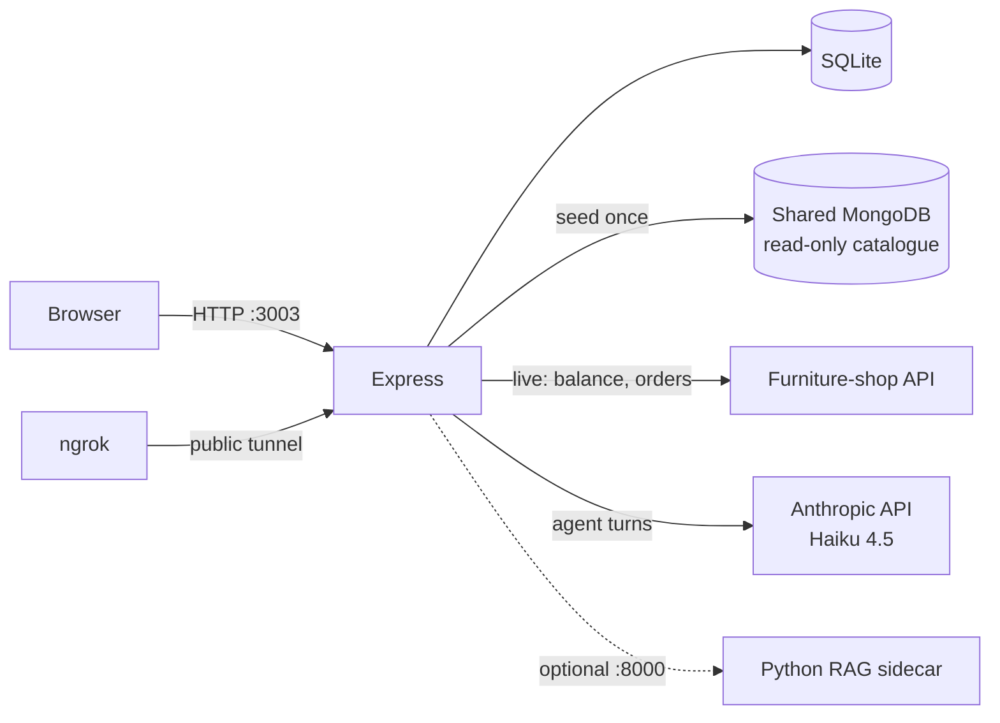
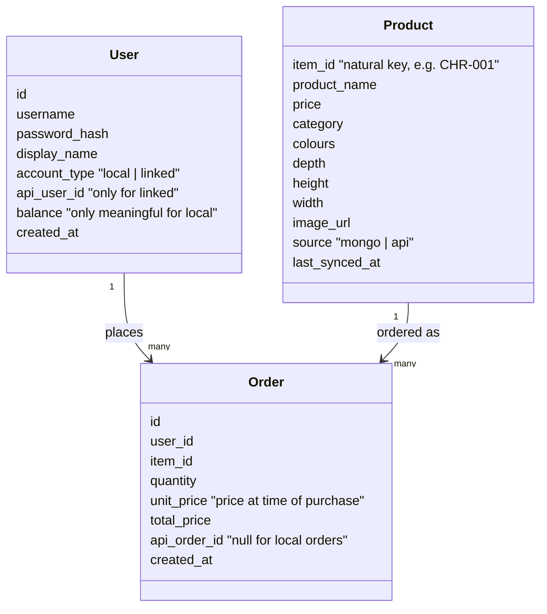

# Architecture

How the app is built. `requirements.md` says what it must do; this file says
how the pieces fit.

## System overview



One Express process serves everything: server-rendered EJS pages, form posts,
and the agent endpoint. SQLite is the app's own storage; the shop API is the
source of truth for the linked user's money; MongoDB is read once to seed the
catalogue (it's the only source of `image_url` and dimensions).

## Entity model



**In plain English:** the app remembers three things. *Users* — people who can
log in; most are "local" (their balance is just a number in our database), and
exactly one is "linked" to the real event API account. *Products* — a local
copy of the shop's catalogue, seeded from MongoDB and refreshed from the API,
so browsing is fast, images work, and the agent can filter by price or colour
locally. *Orders* — every purchase, recorded with the price at the moment it
happened; real orders (placed through the shop API) also carry the API's order
id, which is what links to the PDF invoice.

Level 3 conversation state (chat history + tool results per session) is
in-memory only — deliberately not an entity; it does not survive a restart.

## Identity: Option A

The event API issues one user_id + one key that can only act as itself.

- **Local users**: balance lives in the `User` row. Overspend rule enforced in
  our own order logic. Any number of them; registration form or seed.
- **Linked user**: one seeded row with `account_type = linked`. Balance is
  never stored — always fetched from `GET /users/{api_user_id}`. Orders go
  through `POST /orders` and are mirrored into our `Order` table with
  `api_order_id` set. The API key lives in `.env`, never in the database.

Both go through the same account-service interface; the implementation is
picked per user by `account_type`. This is what makes the Level 1 → Level 2
swap a configuration of the same code rather than a rewrite.

## Services layout (inside Express)

| Service | Responsibility |
|---|---|
| catalogue service | Seed from Mongo; refresh from `/catalogue/search-index` at boot; local queries (category/price/colour) for pages and agent tools |
| account service | `getBalance`, `placeOrder`, `getOrders` — local-DB implementation for local users, shop-API implementation for the linked user |
| shop API client | The only module that talks to the furniture API: base URL + key from `.env`, `X-Api-Key` header, maps 402/404/429 to typed errors, respects `Retry-After` |
| agent service | Anthropic SDK loop: system prompt, four tools, in-memory session store, pending-order tokens |

## Agent design (Level 3)

Four tools, all thin wrappers over the services above:

| Tool | Backs onto | Notes |
|---|---|---|
| `search_products` | catalogue service (local SQL) | Real price/colour/category filters; description honest that the upstream API itself only does exact category match |
| `get_product_details` | catalogue service | Dimensions + image_url; never base64 into model context |
| `check_balance` | account service | No parameters — identity comes from the session, never from the model |
| `place_order` | account service | Two-step, see below |

**Confirm-before-purchase (enforced in code, not prompt):** the first
`place_order` call returns `needs_confirmation` with item, price, and
balance preview, and stores a short-lived pending token server-side. The
agent relays the preview and stops. Only when the user's next message
confirms does a second call — carrying that token — actually execute. The
model cannot fabricate a valid token, so it physically cannot skip the step.
This same token gives duplicate-submission protection.

**Failure behaviour:** tool errors come back structured ("insufficient
balance: have $X, costs $Y"); the system prompt directs the agent to explain
and suggest alternatives, and never to retry a failed order unprompted.

**Evals:** `npm run eval` runs the agent loop against mocked services and
asserts on tool-call traces (see requirements.md for the scenario list). No
eval ever touches the real API. Model ID is `.env`-configurable so the same
suite compares Haiku vs Sonnet if needed.

## Ports & processes

| Process | Port | Notes |
|---|---|---|
| Express | 3003 | `PORT` in `.env`; ngrok targets this |
| RAG sidecar (optional) | 8000 | `RAG_URL` in `.env`; app must run fine without it |
| ngrok inspection UI | 4040 | ngrok's own default |

3000, 4000, 5000, 7000, 8081 are occupied/reserved on this machine — never use.

## Repo layout (planned)

```
app.js                  # Express bootstrap
routes/                 # pages + form posts + /assistant endpoint
services/               # catalogue, account, shop-api client, agent
views/                  # EJS templates
db/                     # SQLite init, migrations-lite, seeds
evals/                  # agent eval scenarios + runner (mocked services)
public/                 # static assets
rag-sidecar/            # optional Python FastAPI service (Step 8)
.env.example            # committed; .env is gitignored
```
